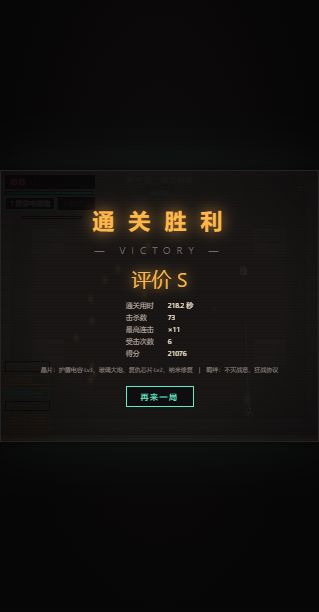

# v1.10 小怪难度标定

> 历史候选报告：武器／护盾规则已在 v1.11 修正，当前数值与验收见 [v1.11 报告](hero-difficulty-v1.11.md)。

2026-10-07，基于 v1.9 `458bd1a`。操作者指定：沿用 Boss 的 batch 方法，**单房 AI 通过率 <37%**。
结果与配置见 [JSON 报告](enemy-difficulty-v1.10.json)。

## 场景口径

- 每个普通战斗房 100 场景：4 英雄等权 ×25 连续种子，7 房共 700 场景。
- 使用 Boss 标定的 M3：`commit=30,trackK=3,sight=100,delay=10,dashSkip=0.6`。
- 满生命、满护盾开局；携带与矩阵相同的区域期望构筑，保留真实地图、两波预算、精英概率、箱子与掉落。
- 第 1 区白板；第 2 区为 overcharge/servo +8% 强化；第 3 区增加 crit/capacitor、+16% 强化和 1 护盾；
  第 4 区增加 pierce/nano、+24% 强化和 2 护盾。开局构筑只作阶段期望，不预扣生命。
- `chipOffered` 代表两波肃清，通过立即结束，不进入晶片、商店或传送门导航。
- 分母包含全部场景；正常阵亡降低通过率，超时/停滞/异常/坐标违规会让整批验收失败。
  通过率还须大于 0，防止全灭配置被接受。
- 标定种子 1–25，另用种子 26–50 验证；后者未参与倍率选择。

## 结果

| 战斗房 | 原始小怪（1–25） | v1.10（1–25） | 验证批（26–50） |
| --- | --- | --- | --- |
| z1a | 100% | 22% | 28% |
| z1b | 100% | 32% | 17% |
| z2a | 100% | 33% | 30% |
| z2b | 99% | 12% | 24% |
| z3a | 100% | 21% | 36% |
| z4a | 100% | 34% | 24% |
| z4b | 100% | 32% | 27% |

两批 v1.10 共 1400 场景，372 清房、1028 阵亡，超时/停滞/异常/违规均为 0。
原始对照中的 z2b 有 1 次停滞，不能将其作为难度证据；其余 699 场景都清房。

## 落地数值

`js/core.js ENEMY_DIFF` 按区域提供六倍率，目前四区域使用相同附加倍率，继续叠加原有区域成长：

| 参数 | 倍率 | 生效位置 |
| --- | --- | --- |
| hpMul | 4.2 | 普通敌人的基础血量、精英额外血量 |
| speedMul | 1.8 | 普通移动与突击机兵冲锋速度 |
| aggression | 4.5 | 攻击冷却与炮台连射计时的消耗速度 |
| bulletMul | 2.4 | 炮台、徘徊者和镜像残影的弹速 |
| densityMul | 3 | 炮台环弹/连射、徘徊者扇弹、残影弹数量 |
| dmgMul | 4 | 子弹、实体接触、自爆以及狙击激光伤害 |

第一房突击机兵 HP 15→63、炮台 HP 11→46.2；普通子弹和实体接触伤害为 4，狙击激光为 8。
自爆蜂与镜像残影接触伤害仍为 0。冲锋在固定 1/60 步长下位移约 7.65px，保留现有碰撞模型。
刷怪数量/存活上限/生成间隔、精英概率、攻击预警和锁定时间均保持原规则。

难度限定普通房：Boss 房及其召唤物排除小怪倍率。Boss 本体配置与攻击池未变；实验覆盖使用 `G.enemyTuning`，
倍率为覆盖值，未提供的字段仍使用区域表。全部设为 1 可回放原始小怪。

## 验收与验证

```powershell
npm run balance:enemies
node test/enemy-balance.js --seed-start 26 --verify
node test/enemy-balance.js --original
node test/enemy-balance.js --room z1a --try hpMul=4.2,aggression=4.5
npm run test:enemies
npm test
node test/structure.check.js
```

- 难度门：两批均通过，7 房各自 >0 且 <37%，运行故障 0。
- 回归门：子弹/激光/自爆的真实玩家伤害、零接触伤害、Boss 召唤物隔离、batch 边界、
  完整验收注入超时/异常必须退出 1，全部通过。
- 全流程：M2 人类化的 3 种子 +3 英雄局允许阵亡，但超时/异常硬失败；
  原型机 seed=16 完美 bot 在真实当前难度下 227.3 仿真秒通关，双 Boss 全部三阶段、4 次商店、金币经济通过。
  此流程未注入额外火力、无敌或跳关。
- 压力、7200 游戏秒稳定性、隔墙和墙角回归通过；隔墙场景约 13.8s 击杀。
- 行为对照：倍率覆盖为 1，与 `458bd1a` 对比 7 房 +2 Boss，各 1800 帧，共 16200 帧逐帧状态一致。
  比较仅忽略新增 `enemy.diff` 元数据，将循环引用 `laser.owner` 表示为实体 id。
- 浏览器：标题 → 正常 AI 开局（prototype/seed=16）→ 最终 Boss → VICTORY，显示 218.2 秒、73 击杀、6 次受击；
  控制台无警告/错误。浏览器与无头结果分别记录，未据此宣称双端逐帧一致。
- 矩阵冒烟：108 场景为 37 clear /8 bossDown /63 defeat，没有超时或违规；旧矩阵仍因阵亡返回 1。
  普通房耗时基线按种子 1–50 重建（28 模板），Boss 的 8 个模板保留原数据。



## 统计限制与待办

- 37% 是四英雄等权的单房平均，未要求每个英雄分别 <37%。标定批的原型机单房通过率为 28%–92%，
  其他英雄为 4%–36%；报告保留每英雄统计，后续英雄平衡应另设目标。
- 高技巧默认 bot 的普通房通过率为 27%–56%；此配置显著压低整体通关率，不能从单房比例推断真人整局胜率。
  当前完整通关证据集中在原型机；未声明其他英雄完整通关已验证。
- 额外的完美 bot 诊断出现 z4b 停滞，旧矩阵种子 1–50 也有 1 例（prototype/seed=21）；
  对应 [待排查记录](../issue/z4b-perfect-bot-stall.md)。它不计入 M3 难度达标证据。
- [seed=3 传送门导航 BUG](../issue/seed3-portal-navigation-stall.md) 按安排继续延期，诊断脚本固定原始小怪以保留复现。
- 两批各 100 场景是固定样本验收，无法保证任意后续种子都低于 37%；修改数值、英雄或构筑后须重跑并保留报告。
