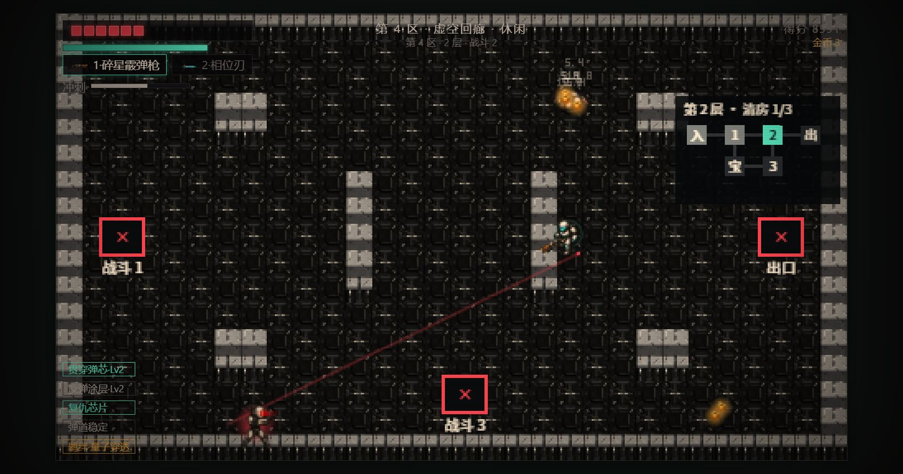

# 002 · 狙击与首领预警线未使用实际墙体遮挡

- 优先级：P2
- 状态：closed（2026-10-09）
- 来源：[实际浏览器通关观察](../qa/browser-playthrough-v1.14.md)
- 修复提交：`2b5105b`

## 复现

第四区第二层战斗 2，狙击手从左下瞄准，玩家移动到右侧竖墙后：红色预警仍穿墙指向玩家。实际开火使用 `G.raycastWall`，掩体生效。首领蓄力预告的 `G0ray` 也只检查屏幕边界。

## 验收条件

- 狙击蓄力/锁定和首领各条蓄力预告在第一面墙前终止。
- 开阔地预告沿相同方向与射程显示；追踪目标和锁定角度不被渲染修改。
- 发射阶段仍与实际伤害射线一致。
- 回归涵盖墙后、无墙、不同射线方向和首领扇形各条射线。

## 修复与验证

狙击蓄力/锁定与首领扇形预告调用实际攻击的 `raycastWall`，保持目标和锁定数据不变；发射阶段继续使用真实伤害光束。
另外修正 4px 采样后只退 3px 导致的斜向终点入墙：仅在落点仍是实心格时退到前一采样点。

浏览器检查狙击双阶段各六种掩体/方向、首领五条扇形预告和真实发射端点；机制测试直接读取地图检查 41 个斜向端点。
完整仿真与 44/44 机制变异检查通过；600 局难度回归通过，运行故障 0。截图和数值见 [验收报告](../qa/browser-fixes-v1.14.1.md)。
