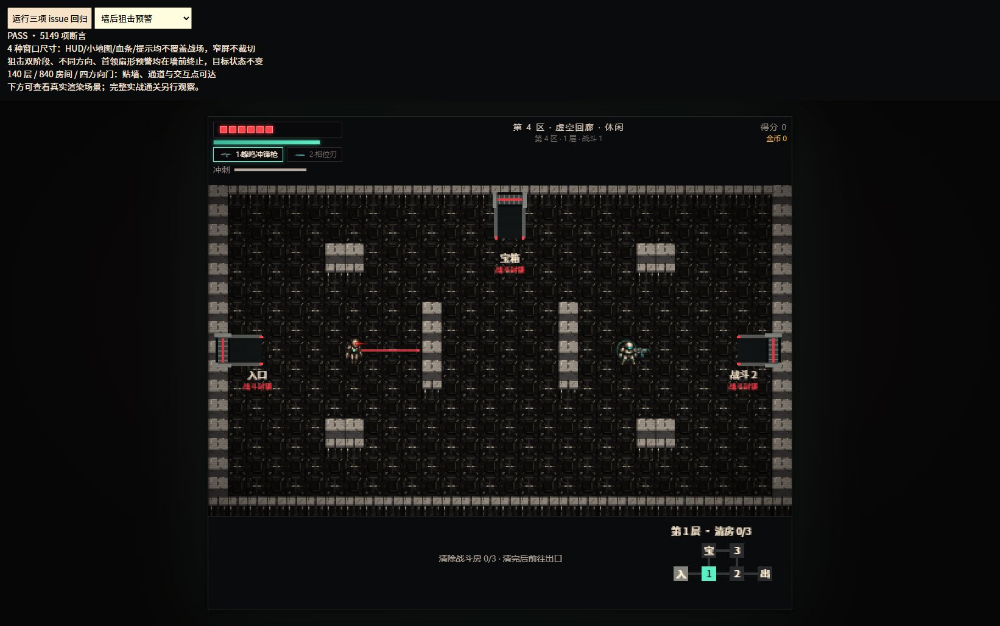
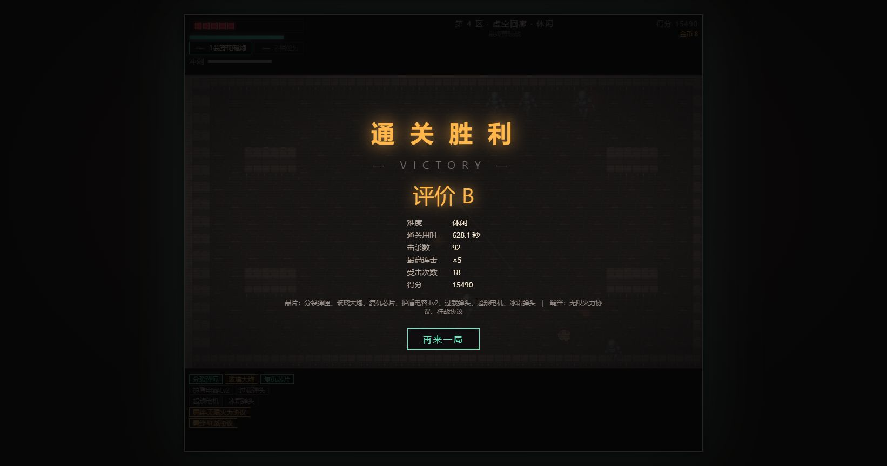

# v1.14.1 · 浏览器观察问题修复验收

日期：2026-10-09。来源为 [v1.14 实际通关观察](browser-playthrough-v1.14.md)，对应本地 [001–003 issue](../issues/README.md)。仓库未配置远程地址，issue 在仓库内跟踪。

## 修复结果

| Issue | 改动 | 验收 |
|---|---|---|
| 001 | HUD、小地图、晶片、提示和首领血条移到画布外；窄屏按比例缩放 | 原右上小地图位置的角色完整可见；4 尺寸无覆盖/裁切 |
| 002 | 狙击双阶段与首领扇形预告使用实际攻击的墙体射线 | 第一面墙前终止；实际发射光束保持原伤害端点 |
| 003 | 沿门交互点向外贴墙绘制通道、门框和封锁门板/开启门洞 | 四向门贴墙、通道不穿墙、交互点可达；E 流程保持 |

射线回归额外发现原来的 4px 采样命中后只退 3px，斜向终点可能深入墙内不足 1px。
现保留原墙前边距，只有落点仍处于实心格时退到前一完整采样点；预告和攻击共用此修正。
未调整难度、敌人、伤害、地图布局或房间切换规则。

## 浏览器验收

通过 Codex 内置浏览器访问本地服务，实际点击 `test/visual-issues.html` 的运行按钮。
该页面将真实游戏加载进 iframe，停止其动画循环，仅为问题验收构造固定位置、预告和 HUD 状态；它不是完整实战证据。

- **5,149 项断言 PASS**：1642×864、1200×1000、409×612、844×390；常驻 HUD 与游戏画布无交叠，战场比例保持 480/272。
- 满 19 枚晶片时列表可滚动；小地图、首领血条、提示不覆盖战场。
- 狙击蓄力/锁定各六种方向与掩体情形；预告终点与实际射线一致，瞄准数据不被渲染修改。
- 首领五条扇形预告全部在第一面墙前停止；发射阶段使用实际伤害光束。
- 20 种子 × 7 层 × 6 房间 = **840 房间**：四方向门洞贴墙、通道可见、交互点均为可达地面。





## 实际对局

另开真实游戏页，从第一区开始；手动移动到房门、按 E 进入首个战斗房，再按 B 启用内置代打。
观察普通房间、出口传送门、各区推进与最终结算；真实 requestAnimationFrame 运行，未注入生命、伤害、跳关或快进。
休闲档最终 **VICTORY：628.1 秒、92 击杀、18 次受击、15,490 分**。
这一局使用 HUD/房门/预警修复后的页面，加载时间早于额外的斜向端点修正；最终端点代码通过上述重新加载的浏览器回归与无头整局验证。



## 自动回归与难度

- `npm test`：多房间、六段曲线、实际完整通关、双首领攻击、7200 游戏秒稳定性、碰撞及机制契约通过；最终代码的 prototype/1979 完美 bot 用时 **803.3 秒**，正常输入、无数值注入。
- `npm run test:rooms`、`test:difficulty`、`test:animation`、`test:mechanics` 均通过。
- `npm run test:mechanics-mutation`：44/44 机制变异检出。
- 机制测试增加 41 条斜向射线，直接读取地图检查终点在墙外；保留近墙射线必须有正向射程的旧断言。
- 原 v1.14 的 seed 501–550、每档四英雄等权 200 局，共 600 局复测结果见下文。该批为回归比较，不再称为独立留出。

| 档位（每档 200 局） | v1.14 通关率 | 修复后通关率 | 道中条件失败率 | 首领条件失败率 | 运行故障 |
|---|---:|---:|---:|---:|---:|
| 挑战 | 37.5% | **37%** | 14.65% | 15.07% | 0 |
| 标准 | 67.5% | **67%** | 5.83% | 7.23% | 0 |
| 休闲 | 98% | **98%** | 0.50% | 0% | 0 |

三档目标均在各自 95% 置信区间内，道中与首领风险差最大 **1.40 个百分点**，保持 ≤5 的验收线。
600 局全部正常胜利或阵亡，胜利局完成 21 个战斗房、四次补给和双首领。
逐局数据：[挑战](../balance/difficulty-v1.14.1-challenge-regression.json)、[标准](../balance/difficulty-v1.14.1-standard-regression.json)、[休闲](../balance/difficulty-v1.14.1-casual-regression.json)。

## 复现

```powershell
npm start
# 浏览器打开 http://127.0.0.1:8941/test/visual-issues.html，点击运行
npm test
npm run test:difficulty
npm run test:animation
foreach ($tier in 'challenge','standard','casual') {
  node test/difficulty-balance.js --difficulty $tier --size 200 --seed-start 501 --workers 4 --holdout --verify
}
```

本次针对三个已观察问题关闭 issue；单局实战与固定种子回归不代表所有随机局、设备和输入组合都没有其他问题。
